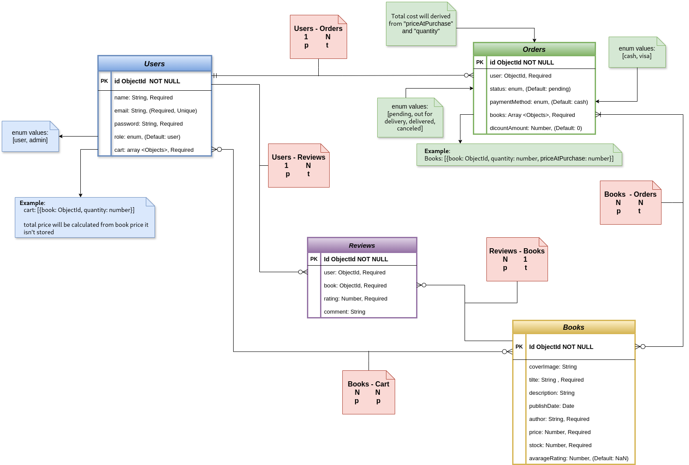

# 📚 Online-Bookstore

## 📖 Project Overview

The **Online Bookstore** is a web-based e-commerce platform where users can browse books, add them to a cart, and place orders. The project covers fundamental backend development concepts and introduces advanced features for independent research.

## 🚀 Features

- 🔐 **User Authentication**: Register, login, and logout securely.
- 📚 **Book Browsing**: Search books by category, author, or title.
- 📝 **Detailed Book Descriptions**: View book details before purchasing.
- 🛒 **Shopping Cart**: Add, update, or remove books.
- 📦 **Order Placement**: Place orders and track purchase history.
- 💳 **Payment Gateway Integration** _(optional)_.
- 🛠️ **Admin Panel**: Manage books, orders, and users.
- 🚀 **Caching Data**: Use Redis to store frequently accessed data for faster retrieval.
- ☁️ **Cloudinary Integration**: Upload and manage book images efficiently.
- 🔔 **Real-Time Notifications**: WebSockets notify admins when a new order is placed.
- 📩 **Email Notifications**: Send automated emails when users register, place an order, or when order status changes.
- 📜 **Application Logging**: Log system states and events using Winston & Morgan.

---

## 🛠️ Technologies Used

- **Backend**: Node.js, Express.js
- **Database**: MongoDB (Mongoose ODM)
- **Authentication**: JSON Web Token (JWT)
- **Package Manager**: npm
- **Development Tools**: Nodemon, ESLint
- **Caching**: Redis
- **Real-Time Communication**: WebSockets
- **payment Processing**: Stripe
- **Logging**: Winston & Morgan
- **Email Service**: Nodemailer
- **Cloud Storage**: Cloudinary

---

## 📂 Clone the Repository

To get a local copy up and running, use:

```sh
git clone https://github.com/sallmayasser/online-bookstore.git
```

## ⚙️ Installation

```sh
npm install
```

## 📜 Scripts

| Command              | Description                                               |
| -------------------- | --------------------------------------------------------- |
| `npm run start:dev`  | Runs in development mode 🔧 (auto-restarts with nodemon). |
| `npm run start:prod` | Runs in production mode 🚀 .                              |
| `npm run lint`       | Checks for code quality issues.🛡️                         |
| `npm run fix`        | Fixes linting issues automatically.🔄                     |
| `npm run connect `   | to run the admin web socket as client                     |

## 💳 Testing Payments

To simulate different payment scenarios, use the following test card numbers:

- **Successful Payment:** `4242 4242 4242 4242`
- **Payment Requires Authentication:** `4000 0025 0000 3155`
- **Payment Declined:** `4000 0000 0000 9995`

📌 **Note:**

- Use any future expiration date (e.g., `12/34`).
- Use any 3-digit CVC (e.g., `123`).

These test cards work only in **Stripe's test mode** and cannot be used for real transactions.

## Deployment

🚀 The application is deployed on aws ec2 with Ip: (http://3.90.67.177:3000/)

## 📊 Entity Relationship Diagram (ERD)


